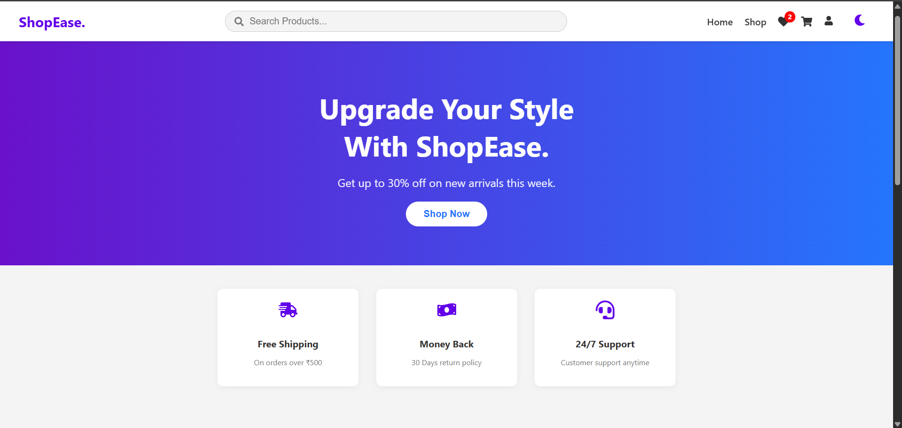
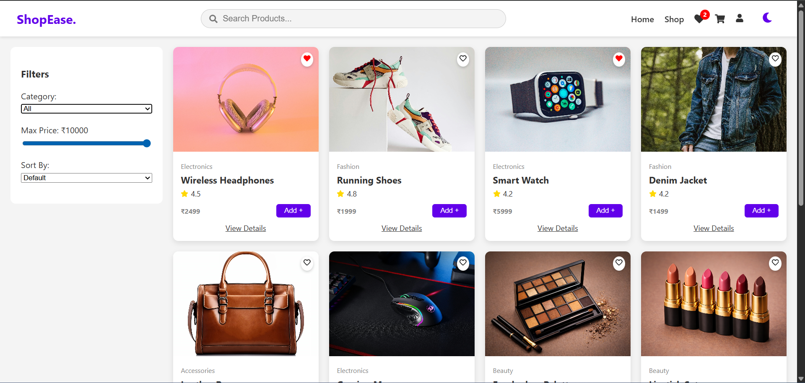
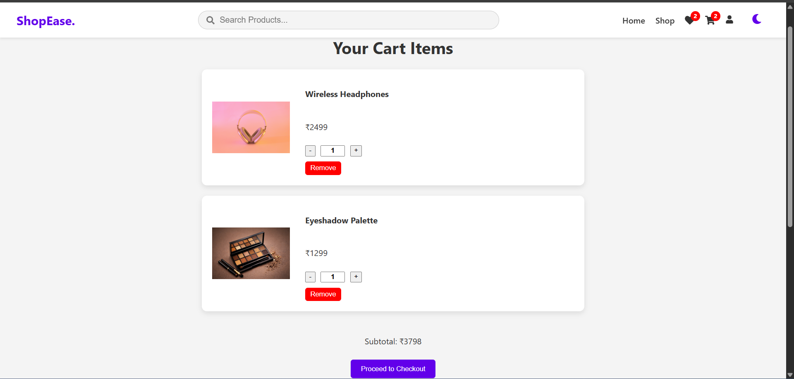

**🛒 Mini E-Commerce App**

A mini e-commerce web application built using React where users can browse products, view product details, add items to cart, and remove from the cart, and manage cart items. This project focuses on core React concepts and clean component-based architecture.

**🔧 Tech Stack**
- React
- JavaScript (ES6+)
- HTML5
- CSS3
- React Hooks (useState, useEffect)

**✨ Features**
- Product listing page
- Product details view
- Add to cart functionality
- Remove items from cart
- Cart item quantity management
- Responsive UI

**📁 Folder Structure**
src/ 
├── components/ 
├── pages/ 
├── context/ 
├── App.jsx 
├── main.jsx 
└── index.css

**📸 Screenshots**
## 📸 Screenshots

### Home Page

### Products Page

### Cart Page

**🚀 How to Run Locally**
Clone the repository git clone https://github.com/PrernaSingh-90/mini-ecommerce-app.git
Install dependencies npm install
Start the project npm run dev

**📚 What I Learned**
Component-based architecture in React
State management using React hooks
Passing props between components
Conditional rendering
Basic cart logic implementation
Writing clean and reusable code

**👩‍💻 Author**
Prerna
Frontend Developer
